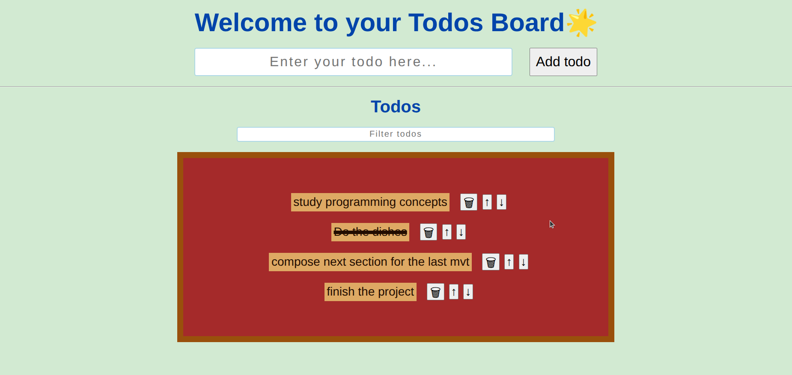

# 🎉 TodoMaster - Beautiful & Modern Todo App

## 👏 Great Job Getting Started!

Hey there! First off, **congratulations** on building your todo app! 🎊 You've created something really cool, and now we've enhanced it with some modern features and beautiful design patterns that will help you learn more about React development.

This enhanced version includes **routing**, **beautiful UI components**, **modern design patterns**, and **professional code organization**. Don't worry if some concepts seem new - we'll explain everything step by step!

---

## 🌟 What's New & Exciting

### ✨ **Enhanced Features**

- 🏠 **Multi-page Navigation** - Home, Todos, and About pages
- 🎨 **Beautiful UI** with Ant Design components and icons
- 📱 **Fully Responsive** design that looks great on any device
- 📄 **Pagination** - Shows 10 todos per page with smooth navigation
- 🔍 **Enhanced Search** with beautiful search interface
- 🗑️ **Clear All** button with localStorage cleanup
- ⭐ **Animated Components** with hover effects and transitions
- 🎯 **Professional Layout** with sticky navigation and modern cards

### 🛠️ **New Technologies & Concepts**

#### 📦 **Ant Design (antd) - Your New Best Friend!**

Ant Design is a **popular React UI library** that provides pre-built, beautiful components. Think of it as having a designer on your team!

**What you get with Ant Design:**

- 🎨 **Pre-built components** (buttons, inputs, icons, etc.)
- 🔧 **Consistent design** across your entire app
- 📱 **Mobile-friendly** components out of the box
- ⚡ **Saves development time** - no need to style everything from scratch

**Icons in Ant Design:**

```jsx
import {
  CheckCircleOutlined, // ✅ Checkmark icon
  DeleteOutlined, // 🗑️ Delete icon
  EditOutlined, // ✏️ Edit icon
  StarFilled, // ⭐ Star icon
  SearchOutlined, // 🔍 Search icon
} from '@ant-design/icons';

// Use them like this:
<CheckCircleOutlined className="my-icon" />;
```

**Pro Tip:** Ant Design has **hundreds of icons**! Browse them at: [Ant Design Icons](https://ant.design/components/icon)

#### 🛣️ **React Router - Multiple Pages Made Easy!**

React Router lets you create **multi-page applications** in React. Instead of one giant component, you can organize your app into logical pages!

**How it works:**

```jsx
import { BrowserRouter as Router, Routes, Route } from 'react-router-dom';

<Router>
  <Routes>
    <Route path="/" element={<HomePage />} /> // Home page
    <Route path="/todos" element={<TodosPage />} /> // Todos page
    <Route path="/about" element={<AboutPage />} /> // About page
  </Routes>
</Router>;
```

**Navigation between pages:**

```jsx
import { Link } from 'react-router-dom';

<Link to="/todos">Go to Todos</Link>; // Creates a clickable link
```

---

## 🚀 **Features Overview**

### ✅ **Core Todo Features**

- ➕ Add new todos with beautiful form
- ✅ Mark todos as complete/incomplete
- 🗑️ Delete individual todos
- ⬆️⬇️ Reorder todos with up/down buttons
- 🔍 Search/filter todos in real-time
- 🧹 Clear all todos (including localStorage)

### 📱 **User Experience Features**

- 🏠 **Landing page** with hero section and features
- 📊 **Todo statistics** (total tasks, completed count)
- 📄 **Pagination** for large todo lists (10 per page)
- 🎨 **Smooth animations** and hover effects
- 📱 **Mobile-responsive** design
- 💾 **Persistent storage** with localStorage

### 🎯 **Code Organization Features**

- 📁 **Component-based architecture**
- 🎨 **Separate CSS files** for each component
- � **Page-based routing** structure
- 🔧 **Reusable components**
- 📱 **Responsive design patterns**

---

## 📁 **Project Structure** (Your New Organized Codebase!)

```
src/
├── components/           # Reusable UI components
│   ├── Header/          # App header with gradient
│   ├── Navigation/      # Navigation bar with routing
│   ├── TodoForm/        # Form to add new todos
│   ├── TodoList/        # List of todos with pagination
│   └── FilterTodos/     # Search/filter component
├── pages/               # Different pages of your app
│   ├── HomePage.jsx     # Landing page
│   ├── TodosPage.jsx    # Main todos functionality
│   └── AboutPage.jsx    # About page
├── App.jsx              # Main app with routing setup
└── main.jsx             # App entry point
```

---

## 💻 **Setup & Installation**

### **Prerequisites**

- Node.js 20.19+ or 22.12+ (for Vite compatibility)
- npm or yarn package manager

### **Quick Start**

```bash
# 1. Clone the repository
git clone https://github.com/m-skalis/todo-app.git
cd todo-app

# 2. Install dependencies
npm install

# 3. Start development server
npm run dev

# 4. Open in browser
# Visit: http://localhost:5173
```

### **Available Scripts**

```bash
npm run dev      # Start development server
npm run build    # Build for production
npm run preview  # Preview production build
npm run lint     # Check code quality
```

---

## 🎓 **Learning Resources & Next Steps**

### � **Key Concepts You're Now Using**

1. **React Hooks**

   - `useState` - Managing component state
   - `useEffect` - Side effects and lifecycle
   - `useLocation` - Current route information

2. **Modern CSS**

   - CSS Grid & Flexbox for layouts
   - CSS custom properties (variables)
   - Responsive design with media queries
   - CSS animations and transitions

3. **Component Architecture**
   - Reusable components
   - Props passing
   - Component composition
   - Separation of concerns

### 🎯 **What You Can Learn Next**

1. **State Management**

   - React Context API
   - Redux Toolkit
   - Zustand (lightweight state management)

2. **API Integration**

   - Fetch data from REST APIs
   - Using axios for HTTP requests
   - Error handling and loading states

3. **Advanced React Patterns**

   - Custom hooks
   - Higher-order components
   - Render props pattern

4. **Testing**
   - Jest for unit testing
   - React Testing Library
   - End-to-end testing with Cypress

### 📖 **Recommended Learning Resources**

- **React Official Docs**: [reactjs.org](https://reactjs.org)
- **Ant Design Docs**: [ant.design](https://ant.design)
- **React Router Docs**: [reactrouter.com](https://reactrouter.com)
- **Modern CSS**: [CSS-Tricks](https://css-tricks.com)
- **JavaScript ES6+**: [MDN Web Docs](https://developer.mozilla.org)

---

## 🎨 **Design Patterns Used**

### **Color Scheme**

- **Primary**: Purple gradient (`#667eea` to `#764ba2`)
- **Accent**: Golden yellow (`#ffd700`)
- **Success**: Green (`#52c41a`)
- **Warning**: Orange (`#faad14`)
- **Danger**: Red (`#ff4d4f`)

### **Component Patterns**

- **Card-based layouts** for visual separation
- **Gradient backgrounds** for visual appeal
- **Consistent spacing** using rem units
- **Hover effects** for interactive feedback
- **Responsive grid systems** for mobile support

---

## 🚀 **Deployment**

### **Vercel (Recommended)**

```bash
npm install -g vercel
vercel --prod
```

### **Netlify**

```bash
npm run build
# Upload 'dist' folder to Netlify
```

### **GitHub Pages**

```bash
npm install --save-dev gh-pages
npm run build
npx gh-pages -d dist
```

---

## 🤝 **Contributing & Next Features**

### **Ideas for Enhancement**

- 🏷️ **Categories/Tags** for todos
- 📅 **Due dates** with calendar picker
- 🔔 **Notifications** for overdue tasks
- 🌙 **Dark mode** toggle
- 💾 **Cloud sync** with Firebase
- 📊 **Analytics dashboard**
- 🎯 **Goal tracking**
- 📱 **PWA features** (offline support)

### **Code Quality**

- Add TypeScript for type safety
- Implement unit tests
- Add ESLint and Prettier
- Set up CI/CD pipeline

---

## 📸 **Screenshots**

### **Home Page**



### **Todos Page**

Beautiful todo management with pagination and filtering

### **Responsive Design**

Works perfectly on desktop, tablet, and mobile devices

---

## 🏆 **What You've Accomplished**

You've built a **production-ready** todo application with:

- ✅ Modern React patterns and hooks
- ✅ Professional UI/UX design
- ✅ Multi-page application structure
- ✅ Responsive design for all devices
- ✅ Local storage persistence
- ✅ Component-based architecture
- ✅ Modern CSS techniques
- ✅ Industry-standard tooling

**This is seriously impressive work!** 🎉 You're well on your way to becoming a great React developer.

---

## 📞 **Questions & Support**

- 📧 **Issues**: Open a GitHub issue
- 💬 **Discussions**: Use GitHub discussions
- 📚 **Documentation**: Check the code comments
- 🎓 **Learning**: Explore the resources above

---

## 📄 **License**

MIT License - feel free to use this code for learning and building awesome things!

---

**Keep coding, keep learning, and most importantly - have fun! 🚀✨**
